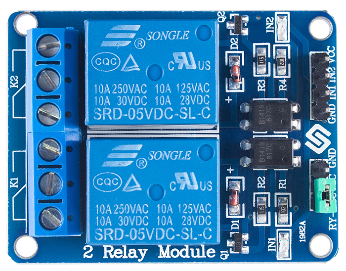
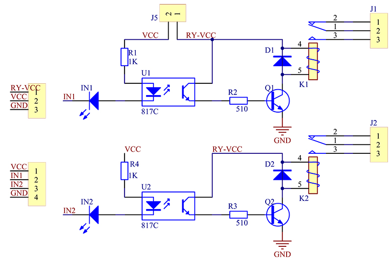
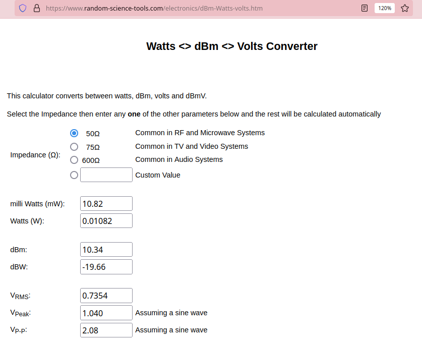
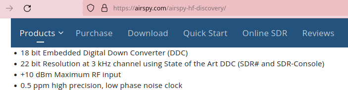
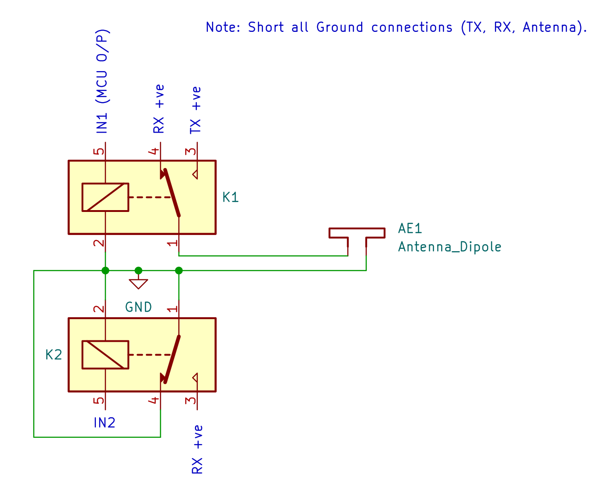
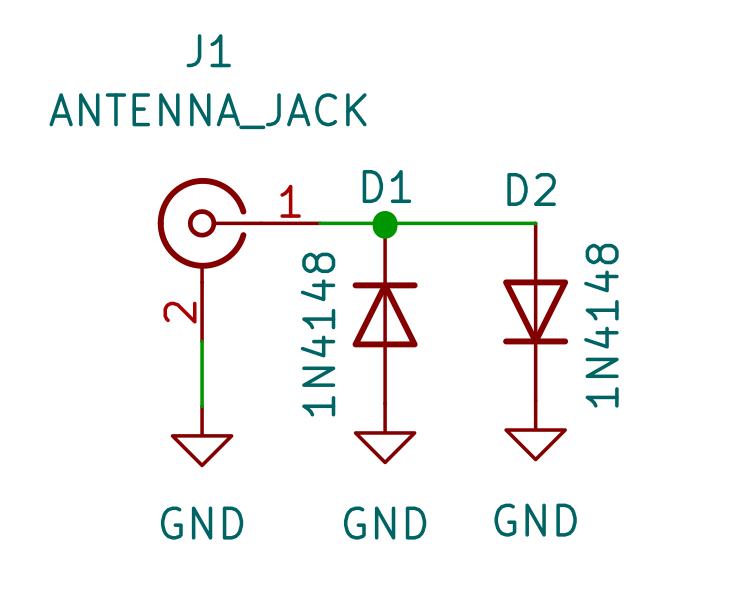
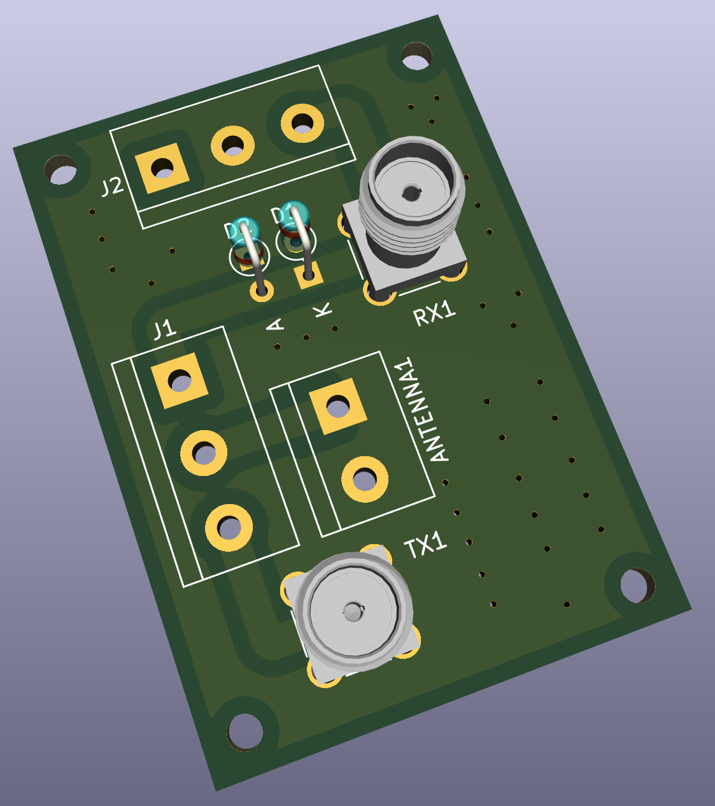

### Simple-TR-Switch

This is a non-RF-sensing, MCU controlled `Simple T/R Switch` with RX Grounding
feature which can be built for less than 2 dollars!

It was designed, and tested for https://github.com/kholia/Easy-Transceiver project.





#### Various approaches

TX power is 10W from IC-705 operating in FM mode.

- With a 2-channel relay as a T/R switch, when both RX Ground and Center are
  disconnected and left floating, a voltage of around ~2.2v is induced across
  RX connections which is unsafe for typical SDRs.

  ~2.2 Vpp is 10.93 dBm!

  https://www.random-science-tools.com/electronics/dBm-Watts-volts.htm

- With a 1-channel relay as a T/R switch which is switching the `Center`
  connection only, and with all Grounds (TX, RX, Antenna) shorted, a voltage of
  around ~1.66v is induced across RX connections which is theoretically safe
  for common SDRs.

- With a 2-channel relay as a T/R switch, with all Grounds (TX, RX, Antenna)
  shorted, with `Center` switching using Channel 1, and RX Center Grounding
  using Channel 2 during TX, a voltage of around ~500mV is induced across RX
  connections which should be fine for most common SDRs.






#### Comparisons

No external 12v power is needed unlike `Easy TR Switch` from https://www.qrpkits.com/ezseries.html.

The ~4000 INR `SDR Transceiver and Receiver Switch Antenna Sharer TR Switch Box
160 MHz` from Banggood doesn't work in `Automatic Mode` if there is
`Broadcast/SW Interference` in your area. The Banggood TR switch switches on
the RTX (red) and disconnects the SDR (RX) as soon as the antenna is connected
under `BCI` conditions, when operating in `Automatic Mode`.


#### Relay Connections

We use a 2-channel relay as a `T/R switch`.

Short all Grounds (TX, RX, Antenna).

```
Channel 1 (In 1):

- COM -> Antenna +ve
- NC -> RX +ve
- NO -> TX +ve
```

```
Channel 2 (In 2)

- COM -> Ground
- NC -> Not Connected
- NO -> RX +ve
```

In TX mode, turn on (i.e. make `NO` active) both Channel 1 and Channel 2, and
you should be good to go!

The following is a rough-schematic, only to show the connections involved.
Please use the relay module in practice. The flyback diodes across the relay
coils are important.




#### Added Protection

Here is another additional mechanism to protect sensitive SDRs.



This is OK for HF (shortwave).


#### Extender PCB

Use this for easy connections ;)



Use 0.5 sq. mm. wire with bootlace ferrules to ensure good contact. Keep the
wires short.


#### Alternate (but riskier) Option

Solid switching using BS170 could be another option.

The [info](./info) folder has more information on this.


#### Results (Feb-2022)

This TR switch affects SWR in the range of 0.10 to 0.15 for the worse, which is
quite acceptable in practice.

The TR switch is not affected by `BCI`.

After RX grounding, the RX line doesn't have any appreciable induced ("picked
up") voltage on it. The actual value couldn't be exactly determined due to
the measurement noise but it was less than 400mV as an rough approximation.
This was measured via an oscope using the differential probing technique
(`CH1 - CH2` in `MATH` mode).

The uSDX RX continued functioning just fine when connected to this TR switch,
after TX'ing 10W from IC-705 transceiver which was also connected to the same
TR switch.


#### BOM Sources

- https://www.electronicscomp.com/2-channel-5v-relay-module-with-optocoupler


#### References

- https://www.giangrandi.org/electronics/diode-clipper/diode-clipper.shtml


#### Credits

Thanks to VU2ASH (Ashok Joshi), K.P.S. Kang, and LW1ECP (Daniel Alonso) for all
the help.
