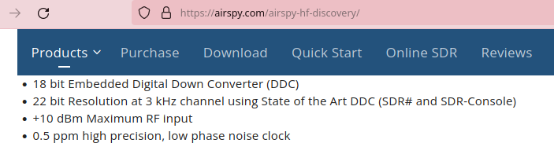

### Simple-TR-Switch

This is a non-RF-sensing, MCU PTT-controlled `Simple T/R Switch` with RX
Grounding feature which can be built for less than 2 dollars!

It was designed, and tested for https://github.com/kholia/Easy-Transceiver project.

#### Various approaches

TX power is 10W from IC-705 operating in FM mode.

- With a 2-channel relay as a T/R switch, when both RX Ground and Center are
  disconnected and left floating, a voltage of around ~2.2v is induced across
  RX connections which is unsafe for typical SDRs.

  ~2.2 Vpp is 10.93 dBm!

  https://www.random-science-tools.com/electronics/dBm-Watts-volts.htm

- With a 1-channel relay as a T/R switch which is switching the `Center`
  connection only, and with all Grounds (TX, RX, Antenna) shorted, a voltage of
  around ~1.66v is induced across RX connections which is theoretically safe
  for common SDRs.

- With a 2-channel relay as a T/R switch, with all Grounds (TX, RX, Antenna)
  shorted, with `Center` switching using Channel 1, and RX Center Grounding
  using Channel 2 during TX, a voltage of around ~500mV is induced across RX
  connections which should be fine for most common SDRs.

#### Comparisons

No external 12v power is needed unlike `Easy TR Switch` from https://www.qrpkits.com/ezseries.html.

The ~4000 INR `SDR Transceiver and Receiver Switch Antenna Sharer TR Switch Box
160 MHz` from Banggood doesn't work in `Automatic Mode` if there is
`Broadcast/SW Interference` in your area. The Banggood TR switch switches on
the RTX (red) and disconnects the SDR (RX) as soon as the antenna is connected
under `BCI` conditions, when operating in `Automatic Mode`.

#### BOM

- 5V 2A DPDT OEN MICRO RELAY 46-05-2C

  - https://etstore.in/index.php/product/oen-micro-relay-5v-dpdt-46-05-2c/
  - https://www.tomsonelectronics.com/products/oen-signal-relay-5v-dpdt

#### Added Protection

Here is another additional mechanism to protect sensitive SDRs.

This is OK for HF (shortwave).

#### Alternate (but riskier) Option

Solid switching using BS170 could be another option.

The [info](./info) folder has more information on this.

#### Credits

Thanks to VU2ASH (Ashok Joshi), K.P.S. Kang, and LW1ECP (Daniel Alonso) for all
the help.

https://circuits-diy.com/optocoupler-relay-driver-with-pc817-2n3904/